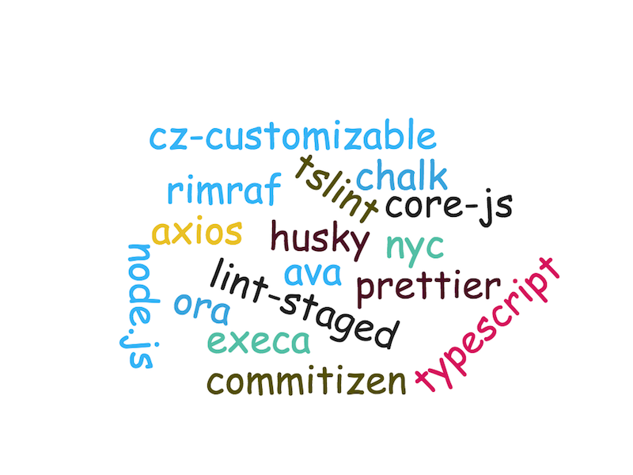

# cli\_

A Node.js command line seed.

### Tech Stack Cloud

 * [node.js](https://github.com/nodejs/node)
 * [typescript](https://github.com/Microsoft/TypeScript)
 * [axios](https://github.com/axios/axios)
 * [chalk](https://github.com/chalk/chalk)
 * [commander](https://github.com/tj/commander.js)
 * [core-js](https://github.com/zloirock/core-js)
 * [inquirer](https://github.com/zloirock/core-js)
 * [ora](https://github.com/sindresorhus/ora)
 * [nyc](https://github.com/istanbuljs/nyc)
 * [execa](https://github.com/sindresorhus/execa)
 * [tslint](https://github.com/palantir/tslint)
 * [ava](https://github.com/avajs/ava)
 * [husky](https://github.com/typicode/husky)
 * [lint-staged](https://github.com/okonet/lint-staged)
 * [cz-customizable](https://github.com/leonardoanalista/cz-customizable)
 * [prettier](https://github.com/prettier/prettier)
 * [commitizen](https://github.com/commitizen/cz-cli)
 * [rimraf](https://github.com/isaacs/rimraf)

### TODO
- [ ] use multiple tsconfig in different env
